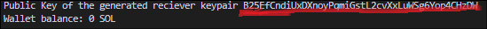

## Getting started with **Solana**

Hello !

I've recently Started Learning **WEB3** from [MetaCrafters.io](https://academy.metacrafters.io/courses)

Join Me and millions of other aspiring web3 developers in your learning journey.

This repo contains everything that I've learnt so far (including assignments and challenges.)

#
Alright Let's get Started.

Fork this repo and clone it in your local system.

```bash
    git clone <repo-link>

    cd <cloned-repo-directory>
```


>install all the dependencies

```
    npm install 
```
All done! run `node index.js` in your terminal .

 ```
    node index .js
 ```

This will create a new key-pair for your very first *web3* Account/Wallet.

And additionally it will Airdrop 2-SOL in your wallet.

>Note: This is just test SOL, only good enough for testing.

>Also, If you run `node index.js` again it'll create a new key value pair corresponding to a new account/Wallet.

See this example highlighted public-key in the below img,

<div align='center'>  


</div>

You'll find a similar newly generated public key in your terminal output.
Copy this public key.
#

*Challenge-1*

Run the following command to check wallet balance and Air-drop additional SOL into your existing wallet/Account.
```bash
    node challenge1.js <previously-copied-public-key>
```
Here we've Air-dropped 1 SOL into the existing wallet as can be seen in the output.

>Note: 1 Lamport = 0.000000001 SOL

You Should get an output as shown below...
<div align='center'>  


 </div>

#


*Challenge-2*

Remember we generated a key-pair using `index.js`,
Let's call it Sender's key-pair or wallet/account.

scroll back to the output and copy the secret key.

 You should find the secret key in an array format as shown -
<div align='center'>  


 </div>

 copy this secret key array and paste it in `challenge2.js` line - 13
 under the variable name `Demo_secretKey` 

 Now run,

    node reciever.js

The above command will create another key-pair for a new Wallet/account where we can send SOL from senders's Account and hence, complete a transaction.
Let's call this newly created account Reciever's Wallet/account.

<div align='center'>  


 </div>

Copy the public key and paste it in the challenge2.js file line - 42 under the varaible name `reciever_publickey`.


That's about it!

You're Done..

Run the Following command -

    node challenge2.js

and you've successfully completed a transaction between sender and reciever's account.
You should get an output like -

<div align='center'>  


 </div>

Using the `transaction Signature` we find in the output, we can check the transaction detials [here](https://explorer.solana.com/). 

#
